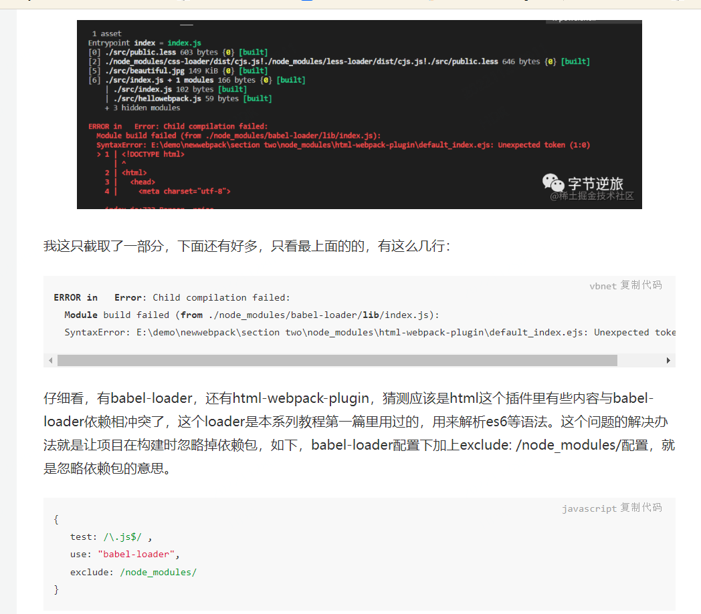

## Webpack

```
yarn add webpack webpack-cli --dev
yarn add 
	webpack webpack-cli 
	css-loader style-loader 
	file-loader 
	url-loader 
	babel-loader @babel/preset-env @babel/core 
	less less-loader
	markdown-loader
	clean-webpack-plugin
	html-webpack-plugin
	
	mini-css-extract-plugin optimize-css-assets-webpack-plugin terser-webpack-plugin
	
	postcss postcss-loader autoprefixer
	--dev
```

```
webpack --config lg.webpack.js
```


#### webpack模块加载方式

- 遵循ES modules标准的import声明
- 遵循CommonJS标准的require函数
- 遵循AMD标准的define函数和require函数
- *样式代码中的@import指令和URL函数
- HTML代码中的href和图片的src属性


#### sourceMap，各种各样

##### devtool: 'eval'原理

```
eval('console.log(234)' //# sourceURL=./foo/bar.js)  // 就会在./foo/bar.js环境下执行js代码
```

##### 开发时：cheap-module-eval-source-map

##### 生产时：nosources-source-map    none...

#### HMR

需要手动处理js模块更新后的替换

```
module.hot.accept('./editor', () => {
    console.log('editor模块更新了，需要这里手动处理热替换逻辑！')
})
```

css的则会自动热更新

#### 开发环境，生产环境的不同配置

####  三种hash

hash: 改一个文件里的代码，所有的hash都会变化

chunkhash: 改一个chunk里面的代码，这个chunk里面的代码hash会变

contenthash: 改一个文件内容，只改变与这个文件内容有关的内容的hash变化


#### HTML-webpack-plugin:

不同html引入不同的js

```
const path = require('path');
const HtmlWebpackPlugin = require('html-webpack-plugin');
module.exports = {
    entry:{//入口文件
        one:"./src/index.js",
        two:"./src/main.js"
    },
    output:{//输出的文件
        path:path.resolve(__dirname,'dist'),
        filename:'[name].boundle.js'
    },
    mode:"development",
    plugins:[
        new HtmlWebpackPlugin({
            template:'./src/one.html',
            filename:'one.html',//生成的html页面的名字为one.html
            title:"one",//它的title为one，记得要在src/one.html中加入<%= %>
            hash:true,
            chunks:['one']
        }),
        new HtmlWebpackPlugin({
            template:'./src/two.html',
            filename:'two.html',
            title:"two",
            hash:true,
            chunks:['two']
        })
    ]
```

#### Tree Shaking

**Tree Shaking 只支持 ESM 的引入方式，不支持 Common JS 的引入方式。**

下面是引入 lodash 的例子，如果引入的是 lodash 中的一部分，则可以 Tree Shaking。

```js
// Import everything (NOT TREE-SHAKABLE)
import _ from 'lodash';

// Import named export (CAN BE TREE SHAKEN)
import { debounce } from 'lodash';

// Import the item directly (CAN BE TREE SHAKEN)
import debounce from 'lodash/lib/debounce';
```

在生产环境下，Webpack 默认会添加 Tree Shaking 的配置，因此只需写一行 **mode: 'production'** 即可。

##### sideEffects 

sideEffects 默认为 true， 告诉 Webpack ，所有文件都有副作用，他们不能被 Tree Shaking。

sideEffects 为 false 时，告诉 Webpack ，没有文件是有副作用的，他们都可以 Tree Shaking。

sideEffects 为一个数组时，告诉 Webpack ，数组中那些文件不要进行 Tree Shaking，其他的可以 Tree Shaking。


#### URL-loader, file-loader

```
/**
 * 01 url-loader base64 uri 文件当中，减少请求次数
 * 02 file-loader 将资源拷贝至指定的目录，分开请求
 * 03 url-loader 内部其实也可以调用 file-loader
 * 04 limit
 *
 */
```

#### 配置删除console.log

1. babel清除

```
npm i -D babel-plugin-transform-remove-console
```

2. webpack清除

   ```
   WebpackCleanConsolePlugin
   ```

   

### 构建优化配置：

- 开发阶段不要使用 copyWebpackPlugin

- 开启tree shaking, webpack 5.x在生产模式默认开启了，开发模式需要配置。

- 模块懒加载

  ```
  // 魔法注释，在打包后会按照这个名字，生成打包的文件名，设置一样就会打包进一个包里
      import(/* webpackChunkName: 'components' */'./posts/posts').then(({ default: posts }) => {
        mainElement.appendChild(posts())
      })
  ```

- mode设置开发模式

- 配置删除console.log.


### ERROR

1. html-webpack-plugin:  多个html输出打包。

   

### next

https://juejin.cn/post/6844904105811378184

https://juejin.cn/post/6844904130620702734#heading-5

https://juejin.cn/post/7152809454927347748#heading-16

https://tiven.cn/p/4352e508/


https://tiven.cn/p/fdbd4224/
