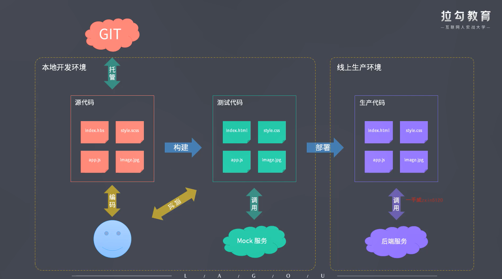
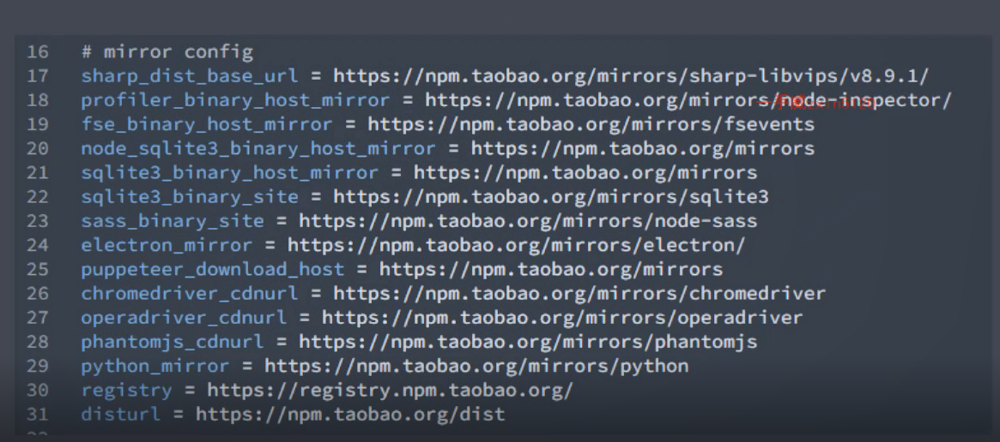

1. 脚手架工具开发
2. 自动化构建系统 
3. 模块化打包
4. 项目代码规范化
5. 自动化部署

## 脚手架

创建项目基础结构，提供项目规范和约定。

#### yeoman:通用型项目创建工具。

通过不同的generator来创建不同语言的项目，可以自己定制generator来实现功能。

加速的配置：

#### plop: 创建特定类型的组件

#### 自动化构建

SASS,ES6...，转换那些不被支持的特性

#### demo

#### 去看zce-cli

https://github.com/zce/caz

## 打包工具

#### webpack

大而全

happypack实现多进程打包

#### Rollup

小而美。

库框架的开发

优点：输出结果扁平，执行效率高，打包结果更容易看

缺点：加载非·esmodule的模块需要配置插件， 模块最终都被打包到一个函数中,不能HMR, 浏览器里代码拆分需要amd类的库

#### parcel

傻瓜式开发，几乎什么都自动化，自动引入，自动分包，HMR...

多进程打包

## 规范化

#### ESlint
