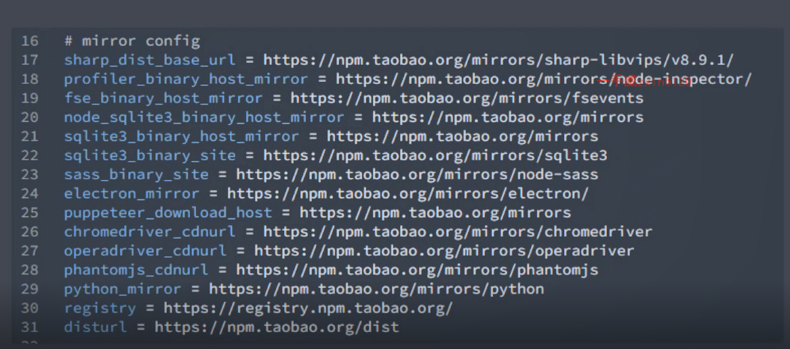

## yeoman:通用型项目创建工具。

基本：

```js
yarn global add yo
// 使用generator-node
yarn global add generator-node
// 运行node generator
yo node
// 根据问题进行配置
```


通过不同的generator来创建不同语言的项目，可以自己定制generator来实现功能。




### SubGenerator

用来创建单个的文件，像eslint配置，.git配置,

```
// 利用sub的子集生成器cli,创建cli应用的基础代码结构
yo node:cli


// 另有
yo node:git
yo node:eslint
yo node:readme
yo node:editorconfig
yo node:boilerplate
```


### 自定义generator:

generator本质上是generator模块

##### 特定目录结构

```
generators                  ---生成器目录
	app                     ---默认生成器目录
		templates           ---存放模板文件
			foo.txt         ---
		index.js            ---默认生成器实现
	component               ---其他生成器目录
		index.js            ---其他生成器实现
package.json                ---模块包配置文件
```

名称要求：

```
generator-<name>
```

##### 创建

generator-sample

```
mkdir generator-sample
cd generator-sample  // 去看这个demo
yarn init
yarn add yeoman-generator      // 里面会有一些工具函数


//generators/app/index.js
const Generator = require('yeoman-generator');
module.exports = class extends Generator{
    initianlizing(){
        //获取当前项目状态，获取基本配置参数等
    }
    prompting(){
        //向用户展示交互式问题收集关键参数
    }
    configuring(){
        //保存配置相关信息且生成配置文件（名称多为'.'开头的配置文件,例如.editorconfig）
    }
    default(){
        //未匹配任何生命周期方法的非私有方法均在此环节*自动*执行
    }
    writing(){
        //依据模板进行新项目结构的写操作
    }
    conflicts(){
        //处理冲突(内部调用，一般不用处理）
    }
    install(){
        //使用指定的包管理工具进行依赖安装(支持npm,bower,yarn)
    }
    end(){
        //结束动作，例如清屏，输出结束信息，say GoodBye等等
    }
}
...


yarn link             // 让其成为全局模块包

yo sample             // 使用生成器
```

##### 根据模板创建文件

看demo

##### 接收用户输入的数据

```
promtping
```

##### vue generator案例

generator-zce-vue,   my-vue-project

```
mkdir generator-zce-vue
cd generator-zce-vue
yarn init
yarn add yeoman-generator

。。。修改EJS的title

yarn link             // 让其成为全局模块包
yo zce-vue             // 使用生成器
```

### 发布

``` --res
1. 先是要放在一个远端创库里
2. 在根目录下
yarn publish
3. 用yarn官网的镜像来发布
yarn publish  --registry=https://registry.yarnpkg.com
```

